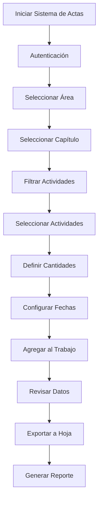
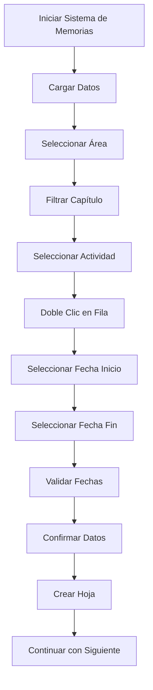
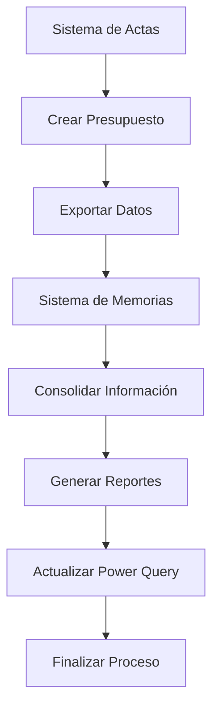

# 📋 MANUAL DE USUARIO - SISTEMA DE GESTIÓN DE MEMORIAS Y ACTAS

## 🎯 **ÍNDICE GENERAL**

1. [Introducción al Sistema](#introducción-al-sistema)
2. [Instalación y Configuración](#instalación-y-configuración)
3. [Sistema de Actas (Proyecto Acta VBA)](#sistema-de-actas-proyecto-acta-vba)
4. [Sistema de Memorias (Proyecto Memorias VBA)](#sistema-de-memorias-proyecto-memorias-vba)
5. [Flujos de Trabajo Integrados](#flujos-de-trabajo-integrados)
6. [Solución de Problemas](#solución-de-problemas)
7. [Preguntas Frecuentes](#preguntas-frecuentes)

---

## 🏢 **INTRODUCCIÓN AL SISTEMA**

### **¿Qué es el Sistema de Gestión de Memorias y Actas?**

Este sistema está compuesto por **dos aplicaciones Excel independientes** que trabajan de forma complementaria para la gestión integral de memorias de trabajo y actas de presupuesto:

- **📊 Sistema de Actas**: Gestión de presupuestos con consecutivos automáticos
- **📝 Sistema de Memorias**: Automatización de tareas y consolidación de datos

### **Beneficios del Sistema**
- ✅ **Automatización completa** de procesos manuales
- ✅ **Consecutivos automáticos** que previenen duplicados
- ✅ **Validación de datos** en tiempo real
- ✅ **Exportación inteligente** a múltiples formatos
- ✅ **Sistema de logging** para auditoría y debugging
- ✅ **Interfaz intuitiva** con formularios responsivos

---

## ⚙️ **INSTALACIÓN Y CONFIGURACIÓN**

### **Requisitos del Sistema**
- Microsoft Excel 2016 o superior
- Macros habilitadas
- Acceso a las hojas de trabajo requeridas
- Permisos de escritura en las carpetas del proyecto

### **Paso 1: Preparación de Archivos**

#### **Archivo 1: Sistema de Actas**
```
📁 Proyecto Acta VBA/
├── 📄 Archivo Excel principal (con macros)
├── 📊 Hoja: "Acta-Presupuesto" (se crea automáticamente)
├── 📊 Hoja: "ListaPrecios_PreciosClientes" (fuente de datos)
└── 📋 Formularios VBA integrados
```

#### **Archivo 2: Sistema de Memorias**
```
📁 Proyecto Memorias VBA/
├── 📄 Archivo Excel principal (con macros)
├── 📊 Hoja: "Consolidado Memorias" (datos consolidados)
├── 📊 Hoja: "EXPORTE_PRESUPUESTO" (fuente de datos)
└── 📋 Formularios VBA integrados
```

### **Paso 2: Configuración Inicial**

1. **Abrir ambos archivos Excel**
2. **Habilitar macros** cuando Excel lo solicite
3. **Verificar que las hojas de datos existan**
4. **Configurar usuarios** en el sistema de seguridad

### **Paso 3: Configuración de Usuarios**

#### **En Sistema de Actas:**
```vba
' Editar en InicioSesion.frm
Private Sub UserForm_Initialize()
    ' Agregar usuarios autorizados
    usuariosAutorizados.Add "usuario1", "contraseña1"
    usuariosAutorizados.Add "usuario2", "contraseña2"
End Sub
```

#### **En Sistema de Memorias:**
```vba
' Configurar en mod_Logger.bas
Public Const LOGGING_ACTIVO As Boolean = True
```

---

## 📊 **SISTEMA DE ACTAS (PROYECTO ACTA VBA)**

### **🎯 Propósito**
Gestión completa de actas de presupuesto con sistema de consecutivos automáticos y validación de datos.

### **🚀 Inicio Rápido**

#### **1. Acceso al Sistema**
1. Abrir el archivo Excel del Sistema de Actas
2. Ejecutar la macro principal
3. **Iniciar sesión** con credenciales autorizadas
4. Acceder al formulario principal

#### **2. Crear Nueva Acta**

**Paso 1: Selección de Área**
- Usar el ComboBox "Área" para seleccionar el área de trabajo
- El sistema cargará automáticamente los capítulos disponibles

**Paso 2: Selección de Capítulo**
- Elegir el capítulo específico del área seleccionada
- El ListBox se actualizará con las actividades disponibles

**Paso 3: Selección de Actividades**
- **Seleccionar múltiples actividades** del ListBox principal
- **Definir cantidad** para cada actividad
- **Agregar al área de trabajo** usando el botón correspondiente

**Paso 4: Configuración de Fechas**
- **Fecha Desde**: Fecha de inicio del trabajo
- **Fecha Hasta**: Fecha de finalización
- **Observaciones**: Notas adicionales (opcional)

**Paso 5: Exportación**
- **Revisar datos** en el ListBox de trabajo
- **Exportar a hoja** "Acta-Presupuesto"
- **Generar PDF** o reporte final

### **🔧 Funcionalidades Principales**

#### **Sistema de Filtros Inteligentes**
```
Área → Capítulo → Actividades
  ↓        ↓         ↓
Filtro 1 → Filtro 2 → ListBox
```

#### **Gestión de Consecutivos**
- **Consecutivo por Área**: Automático e incremental
- **Consecutivo por Capítulo**: Único dentro de cada área
- **Consecutivo por Actividad**: Secuencial dentro de cada capítulo
- **Formato**: `Área.Capítulo.Actividad` (ej: 1.2.14)

#### **Validación de Datos**
- ✅ **Campos obligatorios**: Área, Capítulo, Cantidad
- ✅ **Formato de fechas**: Validación automática
- ✅ **Cantidades numéricas**: Verificación de rangos
- ✅ **Duplicados**: Detección y manejo inteligente

### **📋 Interfaz de Usuario**

#### **Controles Principales**
- **ComboBox Área**: Selección de área de trabajo
- **ComboBox Capítulo**: Filtro dependiente del área
- **ListBox Principal**: Catálogo de actividades disponibles
- **ListBox Trabajo**: Actividades seleccionadas para el acta
- **ListBox Exportados**: Actividades ya procesadas

#### **Botones de Acción**
- **Agregar al Trabajo**: Mueve actividades seleccionadas
- **Asignar Cantidad**: Define cantidades para actividades
- **Exportar Datos**: Guarda en hoja "Acta-Presupuesto"
- **Limpiar Campos**: Resetea el formulario
- **Crear Presupuesto**: Genera reporte final

### **💡 Consejos de Uso**

#### **Para Selección Múltiple**
1. **Ctrl + Click**: Seleccionar elementos individuales
2. **Shift + Click**: Seleccionar rango de elementos
3. **Ctrl + A**: Seleccionar todos los elementos

#### **Para Gestión de Cantidades**
1. **Seleccionar actividades** en el ListBox de trabajo
2. **Usar botón "Asignar Cantidad"** para aplicar cantidad masiva
3. **Editar individualmente** haciendo doble clic en la fila

#### **Para Exportación**
1. **Revisar datos** antes de exportar
2. **Verificar consecutivos** automáticos
3. **Confirmar fechas** y observaciones

---

## 📝 **SISTEMA DE MEMORIAS (PROYECTO MEMORIAS VBA)**

### **🎯 Propósito**
Automatización de tareas de consolidación, exportación y gestión de datos con integración Power Query.

### **🚀 Inicio Rápido**

#### **1. Acceso al Sistema**
1. Abrir el archivo Excel del Sistema de Memorias
2. Ejecutar la macro principal
3. Acceder al formulario de trabajo

#### **2. Creación Rápida de Memorias**

**Método 1: Doble Clic**
- **Doble clic** en cualquier fila del ListBox
- Seguir el flujo guiado paso a paso

**Método 2: Botón de Acción**
- **Seleccionar fila** en el ListBox
- **Hacer clic** en "Crear Memoria Rápida"

**Método 3: Teclado**
- **Seleccionar fila** en el ListBox
- **Presionar Enter** o **F2**

#### **3. Flujo de Creación Rápida**
1. **Selección de fecha de inicio** → Campo F_Desde
2. **Selección de fecha de fin** → Campo F_Hasta
3. **Validación automática** de fechas
4. **Registro automático** en ListBox
5. **Confirmación detallada** con datos de la memoria
6. **Creación automática** de la hoja

### **🔧 Funcionalidades Principales**

#### **Sistema de Filtros Dependientes**
- **Filtro Principal**: Selección de área de trabajo
- **Filtro Secundario**: Capítulos relacionados
- **Actualización automática** del ListBox principal

#### **Integración Power Query**
- **Actualización automática** de tablas
- **Consolidación de datos** de múltiples fuentes
- **Sincronización** con datos externos

#### **Sistema de Logging**
```vba
' Control centralizado de logs
Public Const LOGGING_ACTIVO As Boolean = True

' Niveles de logging disponibles
LogInfo("Mensaje informativo")
LogWarn("Advertencia del sistema")
LogError("Error crítico")
```

### **📋 Interfaz de Usuario**

#### **Controles Principales**
- **ComboBox ITEMS**: Filtro principal de áreas
- **ComboBox Capítulo**: Filtro secundario
- **ListBox Principal**: Datos filtrados y seleccionables
- **Campos de Fecha**: F_Desde y F_Hasta
- **Botones de Acción**: Crear, Limpiar, Exportar

#### **Funcionalidades Avanzadas**
- **Selección múltiple inteligente**
- **Validación de coherencia** de fechas
- **Integración con calendario** visual
- **Exportación personalizada**

### **💡 Consejos de Uso**

#### **Para Filtrado Efectivo**
1. **Seleccionar área** en el primer ComboBox
2. **Esperar carga** del filtro secundario
3. **Seleccionar capítulo** específico
4. **Revisar resultados** en el ListBox

#### **Para Creación Rápida**
1. **Usar doble clic** para flujo automático
2. **Verificar fechas** antes de confirmar
3. **Revisar datos** en la confirmación
4. **Guardar progreso** regularmente

---

## 🔄 **FLUJOS DE TRABAJO INTEGRADOS**

### **Flujo 1: Creación Completa de Acta**



### **Flujo 2: Creación Rápida de Memoria**



### **Flujo 3: Trabajo Conjunto**



---

## 🛠️ **SOLUCIÓN DE PROBLEMAS**

### **Problemas Comunes**

#### **1. Error de Autenticación**
**Síntoma**: No se puede acceder al sistema
**Solución**:
```vba
' Verificar credenciales en InicioSesion.frm
' Asegurar que el usuario esté en la lista autorizada
```

#### **2. ListBox Vacío**
**Síntoma**: No se cargan datos en el ListBox
**Solución**:
1. Verificar que la hoja de datos exista
2. Comprobar que los datos tengan el formato correcto
3. Revisar las conexiones de Power Query

#### **3. Error de Consecutivos**
**Síntoma**: Consecutivos duplicados o incorrectos
**Solución**:
```vba
' Usar la función de validación
Call ValidarConsecutivosDuplicados(frm, area, capitulo, consecutivo)
```

#### **4. Problemas de Exportación**
**Síntoma**: Error al exportar datos
**Solución**:
1. Verificar permisos de escritura
2. Comprobar que la hoja destino exista
3. Revisar el formato de los datos

### **Logs de Debugging**

#### **Activar Logging Detallado**
```vba
' En Modulo_Logs.bas
Public Const LOGS_ACTIVOS As Boolean = True
```

#### **Revisar Logs**
1. Abrir **Ventana Inmediato** en VBA
2. Ejecutar operaciones
3. Revisar mensajes de debug

### **Mantenimiento del Sistema**

#### **Limpieza Regular**
1. **Archivos temporales**: Eliminar archivos .tmp
2. **Logs antiguos**: Rotar archivos de log
3. **Datos obsoletos**: Limpiar hojas temporales

#### **Backup de Datos**
1. **Exportar datos** regularmente
2. **Guardar configuraciones** de usuario
3. **Documentar cambios** en el sistema

---

## ❓ **PREGUNTAS FRECUENTES**

### **P: ¿Cómo restablecer el sistema si hay errores?**
**R**: 
1. Cerrar todos los archivos Excel
2. Reabrir los archivos
3. Ejecutar la macro de inicialización
4. Verificar que las hojas de datos existan

### **P: ¿Cómo agregar nuevos usuarios al sistema?**
**R**: 
```vba
' Editar en InicioSesion.frm
Private Sub UserForm_Initialize()
    usuariosAutorizados.Add "nuevo_usuario", "nueva_contraseña"
End Sub
```

### **P: ¿Cómo cambiar el formato de fechas?**
**R**: 
```vba
' Modificar en la configuración del formulario
Private Const FORMATO_FECHA As String = "dd/mm/yyyy"
```

### **P: ¿Cómo desactivar el sistema de logging?**
**R**: 
```vba
' En Modulo_Logs.bas
Public Const LOGS_ACTIVOS As Boolean = False
```

### **P: ¿Cómo recuperar datos perdidos?**
**R**: 
1. Revisar la hoja "Acta-Presupuesto"
2. Verificar el ListBox de exportados
3. Usar la función de carga de datos exportados

---

## 📞 **SOPORTE TÉCNICO**

### **Información de Contacto**
- **Desarrollador**: [Nombre del desarrollador]
- **Empresa**: Fundeso
- **Versión**: 5.00
- **Última actualización**: 16 de agosto de 2025

### **Recursos Adicionales**
- **Documentación técnica**: README.md en cada proyecto
- **Logs del sistema**: Ventana Inmediato en VBA
- **Archivos de configuración**: Módulos de configuración

### **Reportar Problemas**
1. **Activar logging** detallado
2. **Reproducir el error** paso a paso
3. **Capturar logs** de la Ventana Inmediato
4. **Contactar soporte** con la información

---

## 📚 **APÉNDICES**

### **A. Códigos de Error Comunes**
| Código | Descripción | Solución |
|--------|-------------|----------|
| 1004 | Error de aplicación | Verificar permisos |
| 9 | Subíndice fuera de intervalo | Revisar índices de arrays |
| 13 | Tipo no coincide | Verificar tipos de datos |

### **B. Estructura de Archivos**
```
📁 Proyecto/
├── 📊 Sistema de Actas/
│   ├── 📄 Archivo Excel principal
│   ├── 📋 Formularios VBA
│   └── 📊 Hojas de datos
├── 📝 Sistema de Memorias/
│   ├── 📄 Archivo Excel principal
│   ├── 📋 Módulos VBA
│   └── 📊 Hojas de datos
└── 📚 Documentación/
    ├── 📄 Manual de Usuario
    ├── 📄 README técnico
    └── 📄 Guía de migración
```

### **C. Glosario de Términos**
- **Acta**: Documento que agrupa actividades de un proyecto
- **Consecutivo**: Número secuencial automático
- **ListBox**: Control de lista para mostrar datos
- **Power Query**: Herramienta de Excel para datos externos
- **Logging**: Sistema de registro de eventos

---

*Este manual ha sido diseñado para proporcionar una guía completa del sistema de gestión de memorias y actas. Para soporte técnico adicional, contactar al desarrollador.*
